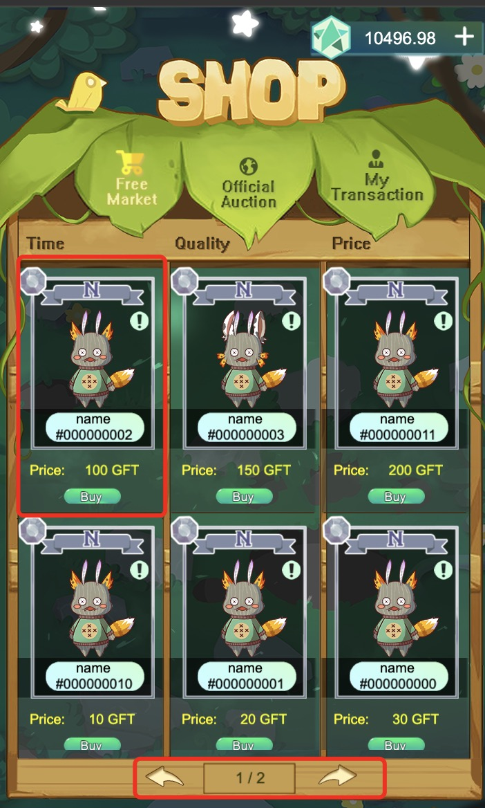
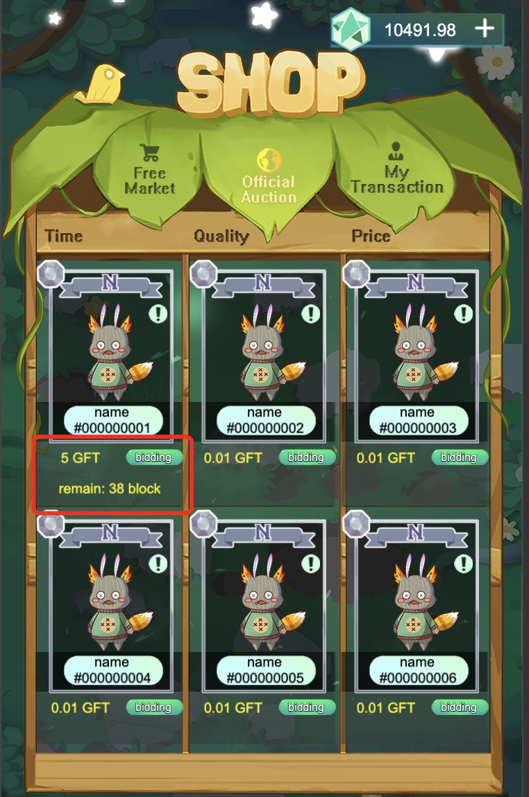
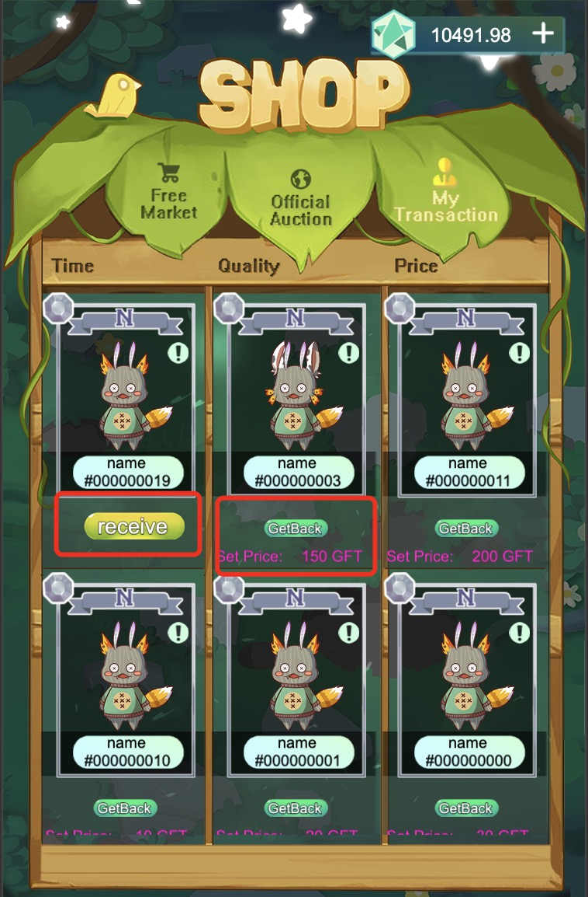
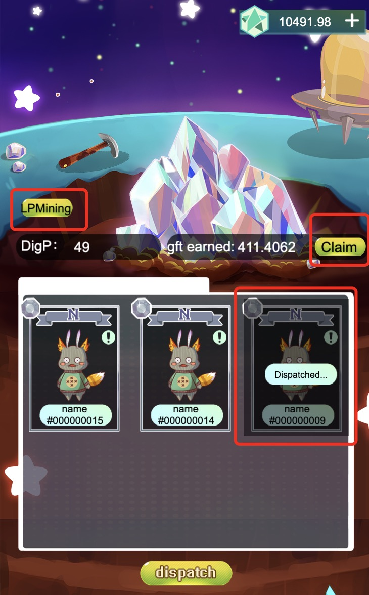

# Project LinkStar - Public Beta Testing

Welcome to Project LinkStar, the highly anticipated crypto/NFT gaming project by GameFantasy! After months of private testing on Testnet, we are excited to open public beta testing on Mainnet. We have made various upgrades to LinkStar recently, including reducing gas fees by more than 50%, but we need your help to test gameplay and patch any bugs before LinkStar is launched to the masses. You will earn $GFT & $GFS tokens during the public beta test（The public beta test from 2021.08.16 10:00am to 2021.08.30 10:am UTC+8） -- join us!

# What is Project LinkStar?#

$GFT is the utility token of Project LinkStar. The total supply is capped at 30 million $GFT. All auctioning, trading, and synthesizing activities within LinkStar are conducted using GFT, as well as future “arena battle” and social interactment features. The vast majority of GFT will be produced in the form of in-game mining, and $GFT transaction fees will be added to the bonus pool for $GFS holders to share.

$GFS is a governance/DAO token for the GameFantasy ecosystem. The total supply is capped at 30 million $GFS with 100% fair distribution (i.e., no team share, no ecological share). $GFS will enable exclusive in-game features and mining rewards and provide governance rights in the LinkStar DAO. $GFS can be earned by providing liquidity for IOTX-GFT pair on mimo and staking IOTX-GFT LP tokens in LinkStar.

# LinkStar Beta Testing Overview

Testing will be performed on the IoTeX Mainnet. Any in-game assets earned (e.g., NFT cards) will be discarded after the official launch of Public LinkStar. However, any $GFT & $GFS tokens earned during the public beta test will be retained by testers. Some tips for beta testers:

1.To perform in-game operations, make sure you have at least 10 IOTX in your wallet for gas.
2.Turn off your VPN and any Ad-Blockers to avoid any wallet connection issues.
3.Testing can be performed on both ioPay Desktop or ioPay Mobile. We recommend you use ioPay Desktop, as in-browser developer logs make it easier for us to locate any bugs.
4.The game loading interface may take up to 10 seconds to load (please wait patiently) and will ask you to sign a transaction with your wallet to enter the game.

# LinkStar Gameplay Instructions

1.My Starmon: view all of your LinkStar NFTs and explore their unique characteristics
2.Polymerization: synthesize two NFTs into another rarer NFT with higher power
3.Market: buy, sell, and trade NFTs with other LinkStar players
4.Starmine: mine $GFT & $GFS by holding NFTs and staking IOTX-GFT LP tokens

Once you enter the LinkStar game, you will see four tabs at the bottom of the main game interface where you will perform various actions:

My Starmon: NFT display interface

The “My Starmon” tab is the default game initialization interface where you can select your language of choice (for now: English, Chinese) and view your LinkStar NFTs. If you don’t have any NFTs yet, don’t worry! You can obtain your first NFT in the LinkStar Market. Once you have NFTs, you can click the exclamation mark in the upper right corner to view the NFT’s unique characteristics. If your NFT’s total score reaches one, the NFT’s background will change. There are 8 colored crystal balls on the bottom of each NFT, each corresponding to the quality/rarity of a body part of your NFT. This allows you to identify which NFTs to synthesize to create higher quality NFTs (more on this in the next section). Finally, the search bar allows you to easily view card attributes corresponding to your NFT ID #.

The upper and middle of the game interface can switch the language displayed in the game. The search function at the bottom of the diagonal can let you easily view the card attributes corresponding to a certain id at present. There are 8 colored crystal balls in the middle of the lower part of each card, and each crystal ball corresponds to the quality of a part of the card. This way you can easily know the approximate quality information of this card and find the appropriate card when you combine it.

Polymerization: NFT synthesis interface

The Polymerization tab allows you to synthesize two NFTs into a higher quality NFT. When synthesizing, all attributes of the “parent NFTs” will be inherited by the newly synthesized NFT, where the quality/rarity of all body parts will not be lower than that of both parents. To retain the quality/rarity of a specific body part, then both parents must have that quality/rarity. To synthesize two of your NFTs, select the two you want to combine and then click “dispatch”, which will call a smart contract and after ~10 seconds you will receive a new composite NFT of higher quality/rarity.

## Market: NFT auction/trading interface

The LinkStar Market interface is divided into three sections:
1.Free Market:

The “Free Market” tab allows you to list your NFTs for sale, or purchase NFTs from other players that have listed theirs for sale. It is up to the NFT owner to decide the listing price. You can click the exclamation mark of each NFT to view its characteristics, and click “Buy” to purchase. Please wait ~10 seconds after confirming for your purchase to settle; if your GFT balance is sufficient, the NFT will be added to your collection. Each page shows up to 10 NFTs, and you can navigate to other pages using the arrows at the bottom of the screen. Filtering features will be added soon so you can search for NFTs with specific characteristics -- stay tuned!

2.Official Auction:

The “Official Auction” tab enables users to purchase first-edition NFTs. There will always be 20 NFTs waiting to be adopted. Once any player bids on one of them, a countdown will begin for a certain number of blocks (each block is ~5 seconds). If another bid is made by another player, the countdown for this NFT auction will be extended by a certain number of blocks. Until there are no new bids, the final bidder will win the auction and receive the NFT, which you can claim in the “My Transaction” tab. Note that the refresh function is currently under optimization, so the list of NFTs available for auction may not be real-time.

3.My Transaction:

The “My Transaction” interface lists all of the NFTs you have, including those you are selling and those you have won at auction. You can also list your NFTs for sale on the “Free Market” via the “My Transactions” tab. Once you list your NFT for sale and someone purchases your NFT, a 0.3% fee (adjustable later by DAO) will be charged and deposited into the community dividend pool for $GFS holders to share. As shown in the above figure, “Receive” indicates NFTs you bid for from auction, and “Get Back” indicates NFTs you have listed for sale on the “Free Market” that you can revoke at any time. Note that there is no time limit for “Free Market” sales.

# StarMine: NFT mining interface

In the “StarMine” tab, you can mine $GFT by dispatching your NFTs as well as mine $GFS by staking your IOTX-GFT LP tokens. Let’s start with $GFT mining -- all LinkStar NFTs have an attribute called “Dig Power”, which determines the $GFT mining power of each unique NFT. The more Dig Power you have, the more $GFT you can earn, which can then be used to purchase and/or synthesize more NFTs. Once you dispatch an NFT to dig for minerals, the card will be removed from your inventory, but it will still be visible within StarMine and can be recall at any time. In other words, any NFT dispatched for $GFT mining will temporarily not belong to you (i.e., not available for sale) until you recall it back to your inventory. Any NFTs you have dispatched to dig/mine will be displayed in this dashboard, and you can claim your $GFT mining rewards at any time by clicking “Claim”.

# How to mine GFS

To mine $GFS, click on the “LP Mining” button. To mine $GFS, you will first need to provide liquidity to the IOTX-GFT pair on mimo DEX -- you can find instructions here. By providing liquidity to the IOTX-GFT pair on mimo, you will receive IOTX-GFT Liquidity Pool (LP) tokens, which represents your share of the IOTX-GFT token pool. By having IOTX-GFT LP tokens associated with your wallet, you will automatically receive $GFS tokens, which is like holding shares in LinkStar. $GFS holders will share rewards from the bonus pool (e.g., the 0.3% of $GFT transaction fees per NFT sale) and also enable other in-game benefits within LinkStar. $GFS will be distributed 100% fairly and only by way of contributions to the LinkStar game. The $GFS pass-through economy will be released when the game goes live. For now, you can view the $GFS contract address on Testnet at: io1t585efypl4e9ex7xks2upnjm8saawfk0v0s5sj and add as a custom XRC20 address on mimo and iotexscan.

# Contact us

For English：https://t.me/GameFantasyToken

For Chinese: Please search “FantasyGame" on WeChat to join GFT WeChat group.

# Finally, we hope everyone enjoys LinkStar!
